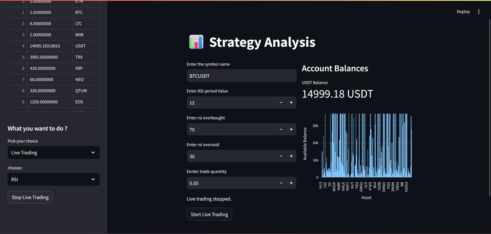
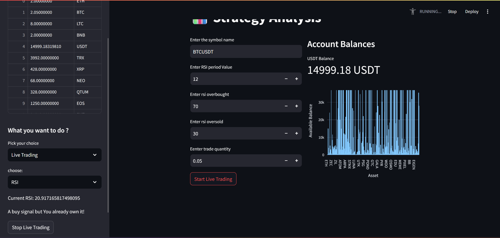
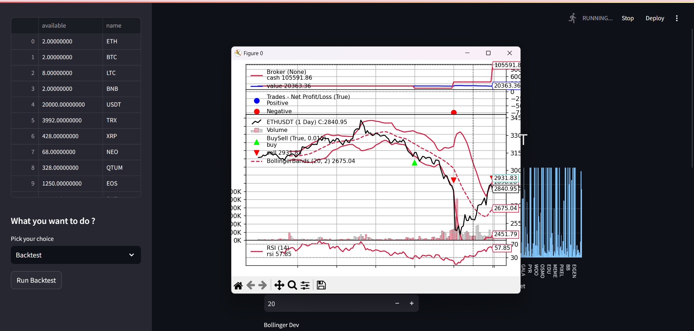

# Backtesting_Crypto


This project is a cryptocurrency trading bot designed to execute buy and sell orders using the Binance API and technical indicators such as RSI and Moving Averages (MA). The bot supports real-time trading on the Binance Testnet and includes a backtesting module using historical data.




## Features
- **Real-time Trading**: The bot uses WebSockets to stream live market data and executes trades automatically.
- **Indicators Used**:
  - RSI (Relative Strength Index) for overbought/oversold conditions
  - SMA (Simple Moving Average) crossover strategy
- **Backtesting Module**: Analyze historical data to test trading strategies.
- **Streamlit UI**: Displays live RSI values, cash balance, and trade signals.

## Installation
Ensure you have Python installed, then install dependencies:
```bash
pip install -r requirements.txt
```

## Requirements
- **TA-Lib Installation**: Download and install TA-Lib manually before running the bot. Follow the official [TA-Lib documentation](https://mrjbq7.github.io/ta-lib/) for installation.
- **Binance API Access**: Requires a Binance API key with testnet access.
  
 you can also  add your Binance Testnet API credentials in the `config.py` file.

1. Open the `config.py` file in your project.
2. Add your API keys like this:
   ```python
   API_KEY = "your_binance_testnet_api_key"
   SECRET_KEY = "your_binance_testnet_secret_key"


## Usage
Run the bot locally:
```bash
streamlit run stream.py
```

### Important Notes
❗ **This bot cannot be run directly on Streamlit Community Cloud** due to Binance Testnet restrictions.

## Example Screenshot
Below is an example of a BUY signal being triggered:



## Backtesting
The project includes a backtesting module that evaluates strategies against historical market data.

 **Indicators Used**:
  - Moving average crossover with rsi indicator
  - Momentum strategy with rate of change indicator
  - Mean Reversion strategy with bollinger and rsi indicators




## Future Enhancements
- Implementing additional indicators
- Support for multiple trading pairs
- Integration with a database for trade logging

## Disclaimer
This bot is for educational purposes only and should not be used for live trading with real funds.

